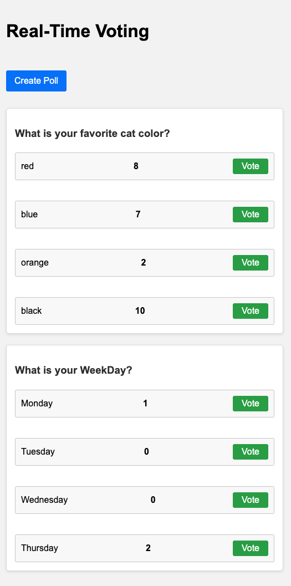

## poll-redis-pubsub

This comprehensive tutorial guides you through building a real-time voting/polling system, complete with an interactive front-end, back-end logic, persistent data storage, and containerization. We will leverage the power of:

- **Go (Golang)**: For robust back-end development with efficient concurrency and simplicity.
- **WebSockets**: For real-time communication between the client and server, allowing live updates.
- **Redis**: As an in-memory data store to handle fast updates and track real-time vote counts.
- **PostgreSQL**: For reliable, persistent storage of polls and vote data.
- **Docker**: For easy development, deployment, and scalability across environments.

### Project Setup:

- **Environment**: Ensure you have Go (GoLang) installed, along with the necessary dependencies like go-redis, pq, and gorilla/websocket packages.
- **Project Structure**: Create a directory for your project (e.g., voting-app) and organize it as follows:

  

### Vote

```
{
    "poll_id": 1,
    "option_index": 0
}
```

### Create Pool

```
{
"question": "What is your favorite programming language?",
"options": ["Go", "Python", "JavaScript", "Java"],
"total_votes": 0,
"created_at": "2023-10-01T12:00:00Z",
"updated_at": "2023-10-01T12:00:00Z"
}
```

### Preflight:

- Run: docker compose up --build --wait

### Run API

- cd server && go run main.go

### Run SQL UI Queries

- Visit: http://localhost:3000/queries/new

### Additional Considerations:

- **Scalability**: Consider using a message queue (like Kafka or RabbitMQ) to handle high vote volumes, along with load balancing techniques.

- **Security**: Implement appropriate authentication and authorization mechanisms to secure your system.

- **Error Handling**: Properly handle errors to ensure graceful recovery.

- **Testing**: Thoroughly test all components to ensure they function as expected.

- **Monitoring and Logging**: Integrate monitoring tools to track application performance and logs.

## Structure

```
voting-app/
├── client/
│ ├── index.html
│ ├── main.js
│ ├── style.css
├── server/
│ ├── main.go
│ ├── models/
│ │ ├── poll.go
│ │ └── vote.go
│ ├── controllers/
│ │ ├── poll.go
│ │ └── vote.go
│ ├── services/
│ │ ├── poll.go
│ │ └── redis.go
│ ├── config/
│ │ └── config.go
│ ├── db/
│ │ └── db.go
│ ├── router/
│ │ └── router.go
│ └── utils/
│ └── websocket.go
├── Dockerfile
├── docker-compose.yml
├── README.md
```
